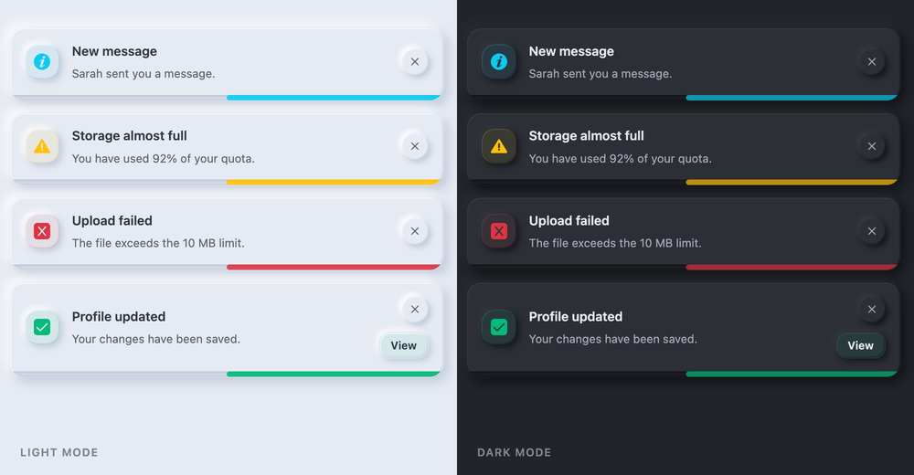

# 🍞 Laravel Toaster Magic — v2.5

Laravel Toaster Magic is a lightweight, dependency-free toast notification package for Laravel with Livewire v3 & v4 support.

Laravel Toaster Magic provides elegant, fully customizable toast notifications for Laravel applications — with **zero dependency** on jQuery, Bootstrap, or Tailwind CSS. It works out of the box with Livewire, supports multiple modern themes, and is simple enough to drop into any project in minutes.

[](https://github.com/devrabiul/laravel-toaster-magic/actions/workflows/tests.yml)
[](https://packagist.org/packages/devrabiul/laravel-toaster-magic)
[](https://packagist.org/packages/devrabiul/laravel-toaster-magic)
[](https://packagist.org/packages/devrabiul/laravel-toaster-magic)
[](LICENSE)
[](https://plant.treeware.earth/devrabiul/laravel-toaster-magic)
[](https://github.com/devrabiul/laravel-toaster-magic)

---

## 🚀 Live Demo

👉 [Try the Live Demo](https://laravel-toaster-magic.rixetbd.com)


---

## ✨ Features

- 🔥 **Easy to Use** — Simple, intuitive API with support for both static and fluent syntax.
- 🌍 **RTL Support** — Full compatibility with right-to-left languages.
- 🌙 **Dark Mode** — Built-in dark mode support via a single HTML attribute.
- 🎨 **9+ Themes** — iOS, Neon, Glassmorphism, Material, Minimal, Neumorphism, Neumorphic, Compact, and Default.
- 🌑 **Shadow Control** — One global switch turns every toast shadow off, whichever theme is active.
- 📏 **Configurable Spacing & Typography** — Global padding, gaps and font sizes that work with any theme.
- 🎞️ **Entrance/Exit Animations** — Choose how toasts enter and leave: `slide`, `fade`, `pop`, or `bounce`.
- 🪄 **Smooth Stack Reflow** — Remaining toasts glide into place (FLIP) when one is added or dismissed.
- 🖼️ **Avatar Toasts** — Render an image in place of the type icon for notification-style toasts.
- ⚡ **Livewire Ready** — Livewire v3 & v4 via a thin event bridge over the same runtime the standard build uses.
- 🔒 **Safe by Default** — Toast text is escaped, URLs are protocol-checked, and HTML is opt-in per toast. See [Security](#-security).
- ♿ **Accessible** — Live-region announcements, a labelled close button, Escape to dismiss, pause on focus, and full `prefers-reduced-motion` support.
- ✅ **Zero Dependencies** — No jQuery, Bootstrap, or Tailwind required.

---

## 📦 Installation

Install the package via Composer:

```bash
composer require devrabiul/laravel-toaster-magic
```

Publish the config file (optional):

```bash
php artisan vendor:publish --tag=toast-magic-config
```

> **Assets** are copied into `public/packages/devrabiul/laravel-toaster-magic` automatically on the first request after an install or upgrade — you do not normally need to publish them.
>
> If you install from a branch (`dev-main`) or a path repository, Composer has no version to compare against, so publish them explicitly after each update:
>
> ```bash
> php artisan vendor:publish --tag=toast-magic-assets --force
> ```

---

## ⚙️ Basic Setup

Add the stylesheet inside your `<head>` tag and the scripts just before the closing `</body>` tag:

```blade
<!DOCTYPE html>
<html lang="en">
<head>
    <meta charset="UTF-8">
    <meta name="viewport" content="width=device-width, initial-scale=1.0">
    <title>Page Title</title>

    {!! ToastMagic::styles() !!}
</head>
<body>

    <!-- Your Content -->

    {!! ToastMagic::scripts() !!}
</body>
</html>
```

---

## 🧑‍💻 Usage

### 1. Controller Usage

Trigger toast notifications from your controllers using the `ToastMagic` facade:

```php
use Devrabiul\ToastMagic\Facades\ToastMagic;

public function store()
{
    // Simple message
    ToastMagic::success('Successfully Created');

    // Message with description
    ToastMagic::success('Success!', 'Your data has been saved!');

    // With custom options
    ToastMagic::success('Success!', 'Your data has been saved!', [
        'showCloseBtn' => true,
        'customBtnText' => 'View Record',
        'customBtnLink' => 'https://example.com',
        'timeOut' => 10000,    // Optional: override the auto-dismiss time (ms) for this toast only
        'showDuration' => 300, // Optional: override the show animation delay (ms) for this toast only
    ]);

    return back();
}
```

**Available toast types:** `success`, `info`, `warning`, `error`

You can also pass a validation `MessageBag` directly — its messages are flattened into a single toast, one per line:

```php
ToastMagic::error($validator->errors());
```

#### 🖼️ Avatar / notification-style toasts

Pass an `avatar` URL to render an image in place of the type icon — ideal for "new message" / "new follower" style notifications:

```php
ToastMagic::info('New message', 'Hey, are you free to chat?', [
    'avatar' => $user->avatar_url,
]);
```

---

### 2. JavaScript Usage

The runtime creates a single shared instance as `window.toastMagic`. Use it directly — **do not call `new ToastMagic()`**, which would build a second instance competing for the same container.

```js
// Options object (recommended)
toastMagic.success({ heading: 'Success!', description: 'Your data has been saved!' });
toastMagic.error({ heading: 'Error!', description: 'Something went wrong.' });

toastMagic.info({
    heading: 'New message',
    description: 'Hey, are you free to chat?',
    showCloseBtn: true,
    customBtnText: 'Reply',
    customBtnLink: '/messages/42',
    avatar: '/avatars/42.png',
    timeOut: 10000,   // 0 = stay until dismissed
    showDuration: 300,
    html: false,      // true renders the text as HTML — you own its safety
});

// Programmatically dismiss all visible toasts
toastMagic.clear();      // or toastMagic.dismissAll();
```

**Positional signature** (still supported for backward compatibility):

```js
toastMagic.success('Heading', 'Description', showCloseBtn, customBtnText, customBtnLink, timeOut, showDuration, avatar);
```

---

### 2a. HTML Data Attributes

Any element carrying `data-toast-type` raises a toast when clicked — no JavaScript required:

```html
<button
    data-toast-type="success"
    data-toast-heading="Saved"
    data-toast-description="Your changes are live."
    data-toast-close-btn
    data-toast-btn-text="View"
    data-toast-btn-link="/records/42"
>Save</button>
```

| Attribute | Purpose |
|-----------|---------|
| `data-toast-type` | `success`, `error`, `warning` or `info`. Anything else falls back to `info`. |
| `data-toast-heading` | Toast heading. Defaults to `Notification`. |
| `data-toast-description` | Optional body text. |
| `data-toast-close-btn` | Presence of the attribute shows the close button. |
| `data-toast-btn-text` | Action button label. |
| `data-toast-btn-link` | Action button URL (protocol-checked). |
| `data-toast-avatar` | Image URL shown in place of the type icon. |

Attribute content is escaped like any other toast text.

---

### 3. Livewire Support (v3 & v4)

Enable Livewire support in your config file:

```php
// config/laravel-toaster-magic.php

return [
    'options' => [
        // your toast options...
    ],
    'livewire_enabled' => true,
];
```

Dispatch toast notifications from any Livewire component:

```php
// With full options
$this->dispatch('toastMagic',
    status: 'success',
    title: 'User Created',
    message: 'The user has been successfully created.',
    options: [
        'showCloseBtn' => true,
        'customBtnText' => 'View Profile',
        'customBtnLink' => 'https://example.com',
    ],
);

// Simple dispatch
$this->dispatch('toastMagic',
    status: 'info',
    title: 'Heads Up',
    message: 'Your session will expire soon.'
);
```

**Supported status values:** `success`, `info`, `warning`, `error`

> **Backward Compatibility:** Both `showCloseBtn` and `closeButton` option keys are supported in Livewire events. If both are provided, `showCloseBtn` takes priority.

---

### 4. Alternative & Fluent Syntax

ToastMagic supports both a quick static method and a fluent dispatch style.

**Static (Quick):**

```php
use Devrabiul\ToastMagic\Facades\ToastMagic;

ToastMagic::success('Operation Successful');
ToastMagic::error('Something went wrong');
```

**Fluent (Advanced):**

```php
ToastMagic::dispatch()->success(
    'User Created',
    'The user has been successfully created.',
    [
        'showCloseBtn'  => true,
        'customBtnText' => 'View Profile',
        'customBtnLink' => 'https://example.com',
    ]
);
```

---

## 📍 Position Options

Control where toasts appear on screen using the `positionClass` config option:

| Value | Position |
|----------------------|--------------------------|
| `toast-top-start` | Top left |
| `toast-top-end` | Top right *(default)* |
| `toast-top-center` | Top center |
| `toast-bottom-start` | Bottom left |
| `toast-bottom-end` | Bottom right |
| `toast-bottom-center` | Bottom center |

---

## 🎨 Themes

ToastMagic includes 9 built-in themes. Set your preferred theme in `config/laravel-toaster-magic.php`:

```php
return [
    'options' => [
        "theme" => "default", // See options below
    ],
];
```

| Theme | Description |
|-----------------|-----------------------------------------------------------|
| `default` | Clean, classic look |
| `material` | Material Design — flat and bold |
| `ios` | Apple-style notifications with backdrop blur |
| `glassmorphism` | Heavy blur, semi-transparent, modern aesthetic |
| `neon` | Dark background with glowing borders — ideal for dark UIs |
| `minimal` | Clean design with colored left-side accent |
| `neumorphism` | Soft UI with extruded shadow styling |
| `neumorphic` | Soft UI, refined — dual-direction shadows, raised controls, recessed progress groove |
| `compact` | Minimal and dense — tight spacing, small footprint, no decorative effects |

For a full theme preview, see [THEMES.md](THEMES.md).

---

### 🧷 Compact

A smaller, denser take on the default toast for interfaces where a notification should stay out of
the way. The surface is deliberately plain — a solid background, a hairline border and a slim
progress bar, with no gradients, blur or glass effects. Everything that costs space is pulled in:
the padding around the toast, the gap between the icon and the text, the gap between the title and
the description, and the space around the close and action controls, which share a single row
instead of being spread down the full height of the toast.

```php
// config/laravel-toaster-magic.php
'options' => [
    'theme' => 'compact',
],
```


- **Footprint** — a 320px track instead of the default 370px, with roughly half the vertical
  padding. On small screens it falls back to the same full-width track as every other theme.
- **Supported toast types** — `success`, `error`, `warning` and `info`, plus avatar toasts, the
  custom action button, color mode and every animation option.
- **Shadow** — kept on the shared `--toast-magic-box-shadow` variable, so
  [`shadow_enable`](#-shadow-control) removes it like it does for any other theme.

---

### 🪶 Neumorphic

A soft-UI theme where the toast reads as an object extruded from the same material as the page
behind it. Depth comes from a dual-direction shadow pair — a light highlight from the top-left and a
soft dark shadow from the bottom-right — plus a hairline inner bevel, instead of borders or
gradients. The icon puck, close button and action button are raised controls that lift on hover and
press *into* the surface on click, and the progress bar sits in a groove carved into the bottom edge.

```php
// config/laravel-toaster-magic.php
'options' => [
    'theme' => 'neumorphic',
],
```



- **Light mode** — a cool off-white surface (`#e6eaf2`) that blends into the page, a white highlight
  and a soft blue-gray shadow.
- **Dark mode** — a dedicated treatment rather than an inversion: a soft charcoal surface
  (`#2c2f36`) on a deeper charcoal page, where the shadow carries the depth and the highlight is
  reduced to a faint light edge. Semantic accents are muted so nothing glows.
- **Supported toast types** — `success`, `error`, `warning` and `info`, plus avatar toasts. The
  surface stays monochromatic for every type; only the icon, the progress fill and the focus ring
  pick up the semantic accent.
- **Customizing** — the theme is driven by CSS variables scoped to `.toast-container.theme-neumorphic`
  (`--tm-neu-surface`, `--tm-neu-shadow-light`, `--tm-neu-shadow-dark`, `--tm-neu-radius`,
  `--tm-neu-distance`, `--tm-neu-blur`, `--tm-neu-accent`). Override any of them in your own
  stylesheet to match your app's surface:

```css
.toast-container.theme-neumorphic {
    --tm-neu-surface: #eef0f5;
    --tm-neu-radius: 1.5rem;
}
```

> **Note:** `neumorphic` is a separate theme from the original `neumorphism` — selecting it does not
> change the look of `neumorphism` or any other theme.

---

## 🌈 Color Mode

Enable color mode to apply toast-type colors automatically to backgrounds and accents:

```php
return [
    'options' => [
        'color_mode' => true,
    ],
];
```

---

## 🌟 Gradient Mode

Enable gradient mode to apply subtle gradients to toast backgrounds:

```php
return [
    'options' => [
        "gradient_enable" => true,
    ],
];
```

> **Note:** Gradient mode works best with the `default`, `material`, and `neon` themes.

---

## 🌑 Shadow Control

Shadows are on by default. Set `shadow_enable` to `false` to render completely flat toasts:

```php
return [
    'options' => [
        'shadow_enable' => false,
    ],
];
```

This is a **global** option, not a theme option — it works with every theme, including themes whose
depth is part of their identity (`neon`'s glow, `neumorphic`'s extrusion, `glassmorphism`'s inner
highlight) and any theme added later. It removes every shadow inside the toast: the toast surface,
the icon puck, the close button and the action button, in their hover and pressed states too.
Borders and background colors are left alone.

| Value | Result |
|---------|-------------------------------------------------------|
| `true`  | Each theme keeps its own shadow *(default)* |
| `false` | Every toast shadow is removed, on any theme |

> **Backward compatible:** a config file published before this option existed simply keeps its
> shadows — the option has to be set to `false` explicitly to turn them off.

---

## 📏 Spacing

Spacing is a **global** option: it works with every theme, not just `compact`.

```php
return [
    'options' => [
        'spacing' => [
            'enable' => true,
            'container' => '10px 12px', // Padding inside the toast
            'icon_gap' => '8px',        // Icon <-> content
            'content_gap' => '2px',     // Title <-> description
            'close_gap' => '6px',       // Content <-> close/action controls
        ],
    ],
];
```

| Key | Controls |
|---------------|----------------------------------------------------------|
| `enable`      | Whether the values below are applied at all |
| `container`   | The toast's internal padding (any valid CSS `padding` value) |
| `icon_gap`    | The gap between the icon (or avatar) and the text |
| `content_gap` | The gap between the title and the description |
| `close_gap`   | The gap between the content and the close/action controls |

Set `'enable' => false` and every theme falls back to its own spacing. The same happens per value:
omit a key (or set it to `null`) and only that one falls back — so you can retune the padding while
leaving the theme's gaps alone.

Want the toast even tighter than `compact`?

```php
'spacing' => [
    'enable' => true,
    'container' => '6px 8px',
    'icon_gap' => '5px',
    'content_gap' => '0px',
    'close_gap' => '4px',
],
```

---

## 🔤 Typography

Also global, and shaped exactly like `spacing`:

```php
return [
    'options' => [
        'typography' => [
            'enable' => true,
            'title_size' => '14px',
            'description_size' => '13px',
        ],
    ],
];
```

| Key | Controls |
|----------------------|-------------------------------------------------|
| `enable`             | Whether the values below are applied at all |
| `title_size`         | The toast title font size |
| `description_size`   | The description/message font size |
| `title_weight`       | *(optional)* The title font weight |
| `description_weight` | *(optional)* The description font weight |
| `line_height`        | *(optional)* Line height for the title and description |

The last three are optional on purpose: leave them out and each theme keeps its own weight and line
height while the sizes still follow your config.

> **How it works:** both sections are resolved into CSS custom properties
> (`--tm-space-container`, `--tm-font-title-size`, …) that are set on the toast container. Every
> theme declares its own value as that property's *fallback*, so an unset property is a no-op and a
> set one overrides every theme — no `!important` overrides, and no theme-specific config. You can
> also set the same properties yourself in a stylesheet if you prefer CSS over config.

---

## 🎞️ Animations

Choose how toasts enter and leave the screen using the `animation` config option:

```php
return [
    'options' => [
        'animation' => 'slide', // default, slide, fade, pop, bounce
    ],
];
```

| Value | Effect |
|-----------|------------------------------------------------|
| `default` | Slide in from the toast's position *(default)* |
| `slide`   | Position-aware slide with its own easing |
| `fade`    | Fade in/out with no movement |
| `pop`     | Scale up from slightly smaller, with a soft overshoot |
| `bounce`  | Slide in with a springy overshoot |

> **Smooth stack reflow:** When a toast is added or dismissed, the remaining toasts glide smoothly into their new positions (using the FLIP technique) instead of jumping. This honors the user's `prefers-reduced-motion` setting and requires no configuration.

---

## 🌙 Dark Mode

Add `theme="dark"` to your `<body>` tag:

```html
<body theme="dark">
```

Every shipped theme has a dark treatment. `neon` is dark by design and looks the same either way; `neumorphism` keeps its light soft-UI surface deliberately and pins its own text colour so it stays readable.

**Using Tailwind or `prefers-color-scheme` instead?** The stylesheet keys off the `theme` attribute, so mirror your existing signal onto `<body>`:

```js
// Tailwind's .dark class on <html>
const sync = () => document.body.toggleAttribute('theme', document.documentElement.classList.contains('dark'))
    || document.body.setAttribute('theme', document.documentElement.classList.contains('dark') ? 'dark' : '');
sync();
```

```css
/* …or follow the OS setting directly */
@media (prefers-color-scheme: dark) {
    body:not([theme]) { /* copy the dark tokens you want here */ }
}
```

---

## ♿ Accessibility

Built in, no configuration required:

- **Announcements** — toasts are announced through persistent live regions. Errors use `role="alert"` (assertive); everything else uses `role="status"` (polite), so a success message never interrupts what a screen reader is reading.
- **Close button** — a real `<button>` with an accessible name (`closeButtonLabel`, default *"Close notification"*). Icons are `aria-hidden`.
- **Keyboard** — <kbd>Esc</kbd> dismisses the most recent toast, so dismissal never depends on the close button being enabled.
- **Focus** — tabbing into a toast pauses its dismiss timer, regardless of the `pauseOnHover` setting, so a toast cannot vanish mid-interaction.
- **Timing** — set `timeOut => 0` (globally or per toast) to keep a toast until it is dismissed. Recommended for anything the user must act on.
- **Reduced motion** — under `prefers-reduced-motion: reduce` every entrance, exit, progress and reflow animation is neutralised; toasts appear and disappear without travel.
- **Touch targets** — close buttons are at least 24×24 px, and 32×32 px on coarse pointers.

Colour-mode backgrounds pick their own foreground per type so text stays above the WCAG AA 4.5:1 contrast ratio.

---

## ⚙️ Full Configuration Reference

```php
// config/laravel-toaster-magic.php

return [
    'options' => [
        'escape_html'       => true,  // Escape toast text. Leave this on.
        'closeButton'       => true,
        'positionClass'     => 'toast-top-end',
        'preventDuplicates' => false,
        'showDuration'      => 300,
        'timeOut'           => 5000,  // 0 = stay until dismissed
        'stagger'           => 250,   // Gap between consecutive queued toasts (ms)
        'theme'             => 'default', // default, material, ios, glassmorphism, neon, minimal, neumorphism, neumorphic, compact
        'gradient_enable'   => false,
        'color_mode'        => false,
        'shadow_enable'     => true, // false removes every toast shadow, on any theme
        'pauseOnHover'      => true, // Keyboard focus always pauses the timer
        'animation'         => 'default', // default, slide, fade, pop, bounce

        // Accessible names
        'closeButtonLabel'  => 'Close notification',
        'containerLabel'    => 'Notifications',

        // Global spacing — 'enable' => false uses each theme's own spacing.
        'spacing' => [
            'enable'      => true,
            'container'   => '10px 12px',
            'icon_gap'    => '8px',
            'content_gap' => '2px',
            'close_gap'   => '6px',
        ],

        // Global typography — 'enable' => false uses each theme's own typography.
        // 'title_weight', 'description_weight' and 'line_height' are optional.
        'typography' => [
            'enable'           => true,
            'title_size'       => '14px',
            'description_size' => '13px',
        ],
    ],

    // One event bridge serves both Livewire v3 and v4.
    'livewire_enabled'  => false,

    // CSP nonce for the inline <script> blocks (or use ToastMagic::nonce()).
    'csp_nonce'         => null,

    // null auto-detects. Set 'public' if your document root is the project
    // root, or '' to force no prefix on published asset URLs.
    'asset_path_prefix' => null,
];
```

---

## 🔒 Security

### Message content is escaped by default

Toast text is written to the DOM with `textContent`, so passing user-supplied input straight into a toast is safe:

```php
ToastMagic::success('Welcome, ' . $user->name . '!');   // safe, no e() needed
```

Multi-line messages still work — newlines become real `<br>` elements *after* escaping:

```php
ToastMagic::info("First line\nSecond line");
```

If you genuinely need markup in a toast, opt in per toast:

```php
ToastMagic::success('<strong>Saved</strong>', null, ['html' => true]);
```

With `['html' => true]` **you** own the safety of that string — escape any user input inside it yourself. There is also a global `escape_html => false` switch, but turning it off makes every toast render raw HTML and is not recommended.

### URLs are validated by protocol

`customBtnLink` and `avatar` are parsed and checked against a protocol allowlist:

| Field | Allowed |
|-------|---------|
| `customBtnLink` | `http:`, `https:`, `mailto:`, `tel:`, plus relative (`/path`) and fragment (`#id`) URLs |
| `avatar` | `http:`, `https:`, plus relative URLs |

Anything else — `javascript:`, `data:`, `vbscript:` — is rejected. A rejected link falls back to `#`; a rejected avatar falls back to the type icon.

URLs are applied with `setAttribute()` rather than being interpolated into an HTML string, so a value containing quotes cannot create additional attributes.

### Content Security Policy

The package emits two small inline `<script>` blocks. Under a CSP that disallows `'unsafe-inline'`, give them a nonce:

```php
{!! ToastMagic::nonce($nonce)->scripts() !!}
```

or set `csp_nonce` in the config when the value is known at config time. External assets are plain `<script src>` / `<link rel="stylesheet">` and need no exception.

### Reporting

Please report vulnerabilities privately — see [SECURITY.md](SECURITY.md).

---

## 📝 Changelog

See [CHANGELOG.md](CHANGELOG.md) for a list of notable changes in each release.

---

## 🤝 Contributing

Contributions are welcome! Please fork the repository, make your changes, and open a pull request.
For bug reports or feature requests, [open an issue on GitHub](https://github.com/devrabiul/laravel-toaster-magic/issues).

---

## 📄 License

This package is open-source software licensed under the [MIT License](LICENSE).

---

## 🌱 Treeware

This package is [Treeware](https://treeware.earth). If you use it in production, we ask that you [**buy the world a tree**](https://plant.treeware.earth/devrabiul/laravel-toaster-magic) to thank us for our work. By contributing to the Treeware forest you'll be creating employment for local families and restoring wildlife habitats.

---

## 📬 Contact & Links

- 🔗 **GitHub:** [devrabiul/laravel-toaster-magic](https://github.com/devrabiul/laravel-toaster-magic)
- 🔗 **Live Demo:** [laravel-toaster-magic.rixetbd.com](https://laravel-toaster-magic.rixetbd.com)
- 🔗 **Packagist:** [packagist.org/packages/devrabiul/laravel-toaster-magic](https://packagist.org/packages/devrabiul/laravel-toaster-magic)
- 📧 **Email:** [devrabiul@gmail.com](mailto:devrabiul@gmail.com)
