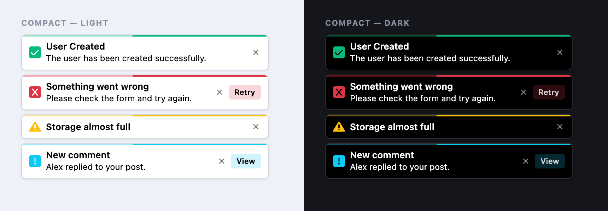

# 🍞 Laravel Toaster Magic — v2.5.0 Release Notes

**Release date:** 2026-08-23
**Type:** Minor release — **one deliberate behavioral change**, see the Upgrade Guide below

v2.5.0 is a **"Safe by default"** release, and the largest one so far. It fixes a **cross-site
scripting vulnerability**, makes message escaping the default, and adds the things people kept
asking for: a **compact theme**, and **global spacing and typography options** that work with any
theme. Under the surface it also removes a per-request filesystem loop that could serve 404s for the
package's own CSS, and consolidates the two JavaScript runtimes into one.

> ⚠️ **Please read the Security Fixes section below.** If you pass user-supplied values to a
> toast — a name, an avatar URL, a link — you were exposed to XSS in v2.4 and earlier.

---

## ✨ Highlights

- 🔒 **XSS vulnerability fixed** *(high severity)* — reachable through `avatar`, `customBtnLink`,
  Livewire event options and `data-toast-btn-link`.
- 🛡️ **Message content is now escaped by default**, with an explicit `['html' => true]` opt-in.
- 🧷 **New `compact` theme** — smaller, denser, deliberately plain.
- 📏 **Global `spacing` and `typography`** — padding, gaps and font sizes, configurable per app.
- ♿ **Accessibility overhaul** — announcements that actually announce, <kbd>Esc</kbd> to dismiss,
  WCAG AA contrast fixes, real touch targets.
- ⚡ **No more per-request asset churn** — publishing converges instead of re-copying every request.
- 🧪 **148 JavaScript tests + a reproducible asset build** where there was previously neither.
- 📦 **~140 KB published payload**, down from ~1.6 MB.

---

## 🔒 Security Fixes

### Cross-site scripting in `sanitizeUrl()` — high severity

The URL sanitiser validated only the *prefix* of a URL and never escaped quotes, and its result was
interpolated into an `innerHTML` string. A value such as:

```
/a" onerror="alert(1)
```

passed the prefix check, closed the `src`/`href` attribute, and injected an event handler.

It was reachable through the `avatar` option — **the README's own example passed a user profile
field** — as well as `customBtnLink`, Livewire event options and `data-toast-btn-link`.

URLs are now parsed with `new URL()`, checked against a protocol allowlist (`http:`, `https:`,
`mailto:`, `tel:`; `javascript:` and `data:` are rejected), and applied with `setAttribute()` — which
makes attribute breakout *structurally impossible* rather than merely filtered.

### Escaping is now the default

Headings, descriptions and action button labels are written with `textContent`. Newlines still
become real `<br>` elements, inserted **after** escaping, so multi-line messages keep working.

```php
// Escaped — safe with any user input
ToastMagic::success('Welcome, ' . $user->name);

// Opt in per toast when you genuinely mean HTML
ToastMagic::success('Welcome, <strong>' . e($user->name) . '</strong>', null, ['html' => true]);
```

### Also hardened

- **Config values are validated against allowlists.** `theme`, `positionClass` and `animation`
  outside the known sets fall back to their defaults instead of being concatenated into output.
- **The emitted JSON is hardened** with `JSON_HEX_TAG`/`HEX_AMP`/`HEX_APOS`/`HEX_QUOT`, so a
  `</script>` inside any value cannot terminate the script block early.
- **Content-Security-Policy support** — `ToastMagic::nonce($nonce)` or the `csp_nonce` config value
  applies a nonce to both inline script blocks. There was previously no way to run this package
  under a policy without `'unsafe-inline'`.

---

## 🚀 What's New

### 🧷 The Compact theme

```php
// config/laravel-toaster-magic.php
'options' => [
    'theme' => 'compact',
],
```



A smaller, denser take on the default toast, for interfaces where a notification should stay out of
the way. Padding, the icon-to-text gap, the title/description gap and the space around the controls
are all pulled in; the close and action buttons share a single row; the progress bar is slimmed to
2px; and the track narrows from 370px to 320px.

Deliberately plain — a solid surface, a hairline border and semantic accents, with **no gradients,
blur or glass effects**. Supports every toast type, avatar toasts, color mode, animations, dark mode
and RTL.

### 📏 Global spacing and typography

Two new sections that work with **any** theme, not just `compact`:

```php
'options' => [
    'spacing' => [
        'enable'      => true,
        'container'   => '10px 12px', // Padding inside the toast
        'icon_gap'    => '8px',       // Icon <-> content
        'content_gap' => '2px',       // Title <-> description
        'close_gap'   => '6px',       // Content <-> close/action controls
    ],

    'typography' => [
        'enable'           => true,
        'title_size'       => '14px',
        'description_size' => '13px',
        // Optional: 'title_weight', 'description_weight', 'line_height'
    ],
],
```

Each value is resolved into a CSS custom property set on the toast container, and **every theme
declares its own value as that property's fallback**. So:

- `'enable' => false` → that whole section falls back to the active theme's own values.
- An omitted or `null` value → *that value alone* falls back, while the rest still apply.
- A value you set → overrides every theme, with no `!important` wars and no theme-specific config.

Want the toast tighter than `compact` ships? Turn the numbers down:

```php
'spacing' => [
    'enable'      => true,
    'container'   => '6px 8px',
    'icon_gap'    => '5px',
    'content_gap' => '0px',
    'close_gap'   => '4px',
],
```

You can also set the same properties directly in a stylesheet if you prefer CSS over config:

```css
.toast-container {
    --tm-space-container: 6px 8px;
    --tm-font-title-size: 14px;
}
```

### 🧰 Smaller additions

| Option | What it does |
|--------|--------------|
| `['html' => true]` | Renders that toast's text as HTML (per toast) |
| `escape_html` | Global escaping switch — off is not recommended |
| `stagger` | Delay between consecutive queued toasts. Was hardcoded at 1000 ms; now configurable, default **800 ms** |
| `maxVisible` | Most toasts on screen at once (default **15**); the oldest is dismissed to make room. `0` = no limit |
| `closeButtonLabel` | Accessible name for the close button |
| `containerLabel` | Accessible name for the toast region |
| `csp_nonce` | CSP nonce for the inline script blocks |
| `asset_path_prefix` | Explicit asset path, replacing the old IP-address heuristic |

---

## ♿ Accessibility

- **Announcements now work.** Toasts were given `role="alert"` and inserted with their content
  already present — which assistive technology frequently does not announce at all. Text is now
  written into persistent live regions: polite for success/info/warning, assertive for errors.
- **The close button has an accessible name** (default *"Close notification"*); it previously
  announced as just "button". Decorative icons are `aria-hidden`.
- **<kbd>Esc</kbd> dismisses the most recent toast**, so dismissal no longer depends on the close
  button being enabled.
- **Keyboard focus pauses the dismiss timer**, regardless of `pauseOnHover`.
- **`timeOut => 0` keeps a toast until dismissed** (WCAG 2.2.1).
- **`prefers-reduced-motion` is honoured throughout** — entrances, exits, the iOS bounce and the
  progress bars, not just the stack reflow.
- **WCAG AA contrast failures fixed.** Color mode forced white text onto every accent: white on the
  amber measured **1.63:1** and on the cyan **1.96:1**, against a 4.5:1 requirement. Warning and info
  now take a dark foreground.
- **Close-button touch targets** are at least 24×24 px, and 32×32 px on coarse pointers.
- Added dark-mode treatments for `glassmorphism` and `minimal`.

---

## 🐛 Notable Fixes

- **Assets are no longer deleted and re-copied on every request.** When the installed version could
  not be resolved — a `dev-*` constraint, a branch alias, a path repository — the check treated
  "unknown" as "republish" and never converged. Every request re-copied the whole asset directory,
  and concurrent requests served **404s for the package's own CSS** out of the gap. Publishing is now
  atomic and converges.
- **`composer.lock` is no longer read on every request.**
- **Published configs now receive new options.** Previously the defaults loaded *only* when no
  published config existed, silently withholding every option added after you published yours.
- **The runtime now reads its configuration.** The config object was emitted *after* the runtime
  `<script>`, so theme, position and close-button settings all stayed on their built-in defaults.
- **`showCloseBtn` works server-side** — documented since v2.2 while only `closeButton` was read.
- **`vendor:publish --tag=toast-magic-assets` exists** — documented for several releases without the
  tag ever being registered.
- **The `slide` animation exists** — it was offered in the config with no CSS behind it.
- **The progress bar tracks the real dismiss time** instead of a hardcoded 3s, and pauses with the
  timer.
- **Asset URLs no longer branch on the client's IP address**, which reported `127.0.0.1` in
  production behind any reverse proxy.
- **`toast-top-end` no longer left-aligns on small screens.**
- **Heading-only toasts no longer leave blank space under the title** — the text block stretched to
  the icon's height and pinned the title to the top, most visible on `ios` with its 38px icon puck.
- **`data-toast-type` is validated** — any truthy property name (`constructor`, `show`, `clear`) was
  previously invoked, throwing an uncaught `TypeError`.

---

## 🔧 Changed

- **One JavaScript runtime.** The Livewire build's 343-line hand-maintained copy had already drifted
  from the standard build in four places. It is **removed**; Livewire now loads the shared runtime
  plus a ~90-line event bridge, and tests assert both paths produce byte-identical markup.
- **Removed the dead `livewire_version` config key** — nothing ever read it. One bridge serves both
  Livewire v3 and v4.
- **`MessageBag` flattening uses newlines instead of `<br>`.** With escaping on, a literal `<br>`
  would display as text. This changes the string stored in the session, not what renders.
- **Marketing images moved out of `assets/`** into `art/`. They were being copied into every
  consuming application's public directory — **1.5 MB of the 1.6 MB published**. The payload is now
  ~140 KB.
- **`useVite()` and `nonce()` return `$this`** for chaining.
- **The leaked global `.position-relative` utility** — a Bootstrap name — is now
  `.toast-magic-relative`.
- **Declared previously implicit dependencies** on `illuminate/config`, `illuminate/session`,
  `illuminate/filesystem` and `illuminate/cache`.
- **Removed the `version` field from `composer.json`** so the git tag is authoritative.

---

## 🧪 Quality

- **148 JavaScript tests** covering rendering, escaping, URL sanitising, timers, the data-attribute
  API, the Livewire bridge and accessibility. The runtime holds essentially all of this package's
  behaviour and previously had **no tests at all**.
- **A reproducible asset build** — `npm run build` regenerates the minified stylesheet, and
  `npm run build:check` fails CI if the committed file drifts from the source.
- **ESLint**, plus CI jobs for the JavaScript suite, the build check and a PHP 8.0 syntax gate.
- **CI now covers the declared floor** (PHP 8.0 / Laravel 8) rather than starting at PHP 8.1 /
  Laravel 10 while advertising lower.

---

## 🧩 Compatibility

| Requirement | Supported |
|-------------|-----------|
| PHP         | 8.0 – 8.5 |
| Laravel     | 8 – 13    |
| Livewire    | v3 & v4   |

---

## ⬆️ Upgrade Guide

```bash
composer update devrabiul/laravel-toaster-magic
php artisan vendor:publish --tag=toast-magic-assets --force
```

Republishing is required — **both the CSS and the JS changed.**

### 1. Toast text containing HTML now renders as text

This is the one behavioral change likely to be noticed, and it is deliberate: the previous default
turned any user-supplied value into an XSS hole. If a call intentionally passed markup, opt in:

```php
// Before (v2.4) — HTML was rendered
ToastMagic::success('Saved <strong>successfully</strong>');

// After (v2.5) — opt in explicitly
ToastMagic::success('Saved <strong>successfully</strong>', null, ['html' => true]);
```

Search your codebase for toast calls containing `<`. Plain-text messages need no changes.

### 2. The new spacing/typography defaults are enabled

`spacing` and `typography` ship **enabled**, and slightly tighter than the historical `default`
theme (10px 12px padding instead of 1.25rem; a 2px title/description gap instead of 4px). Published
configs are merged over the packaged defaults, so this applies on upgrade too.

To keep every theme's original spacing and font sizes exactly as they were in v2.4:

```php
'options' => [
    'spacing'    => ['enable' => false],
    'typography' => ['enable' => false],
],
```

### 3. If you install from a branch or path repository

Auto-publishing no longer treats an unresolvable version as "republish". Run the
`vendor:publish` command above after each update. **Tagged releases are unaffected.**

### 4. If you referenced `.position-relative` or `livewire_version`

The utility class is now `.toast-magic-relative`, and the `livewire_version` config key has been
removed — nothing ever read it, so you can simply delete it from your published config.

---

## 🙏 Thanks

Thanks to everyone using and reporting issues on Laravel Toaster Magic. If it helps you in
production, consider [planting a tree](https://plant.treeware.earth/devrabiul/laravel-toaster-magic). 🌱

**Full changelog:** see [CHANGELOG.md](CHANGELOG.md).
